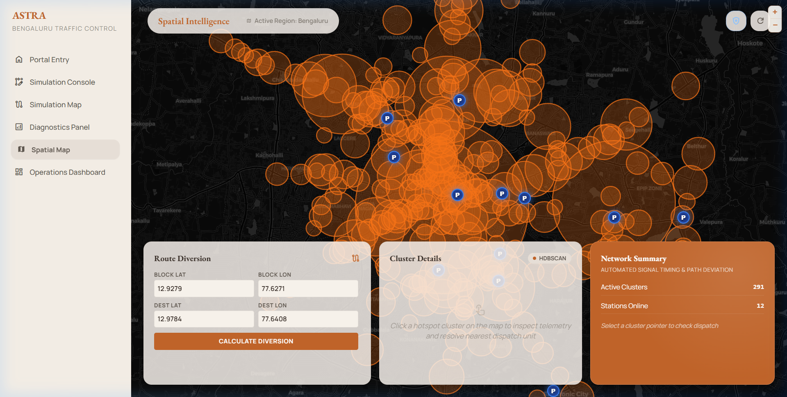
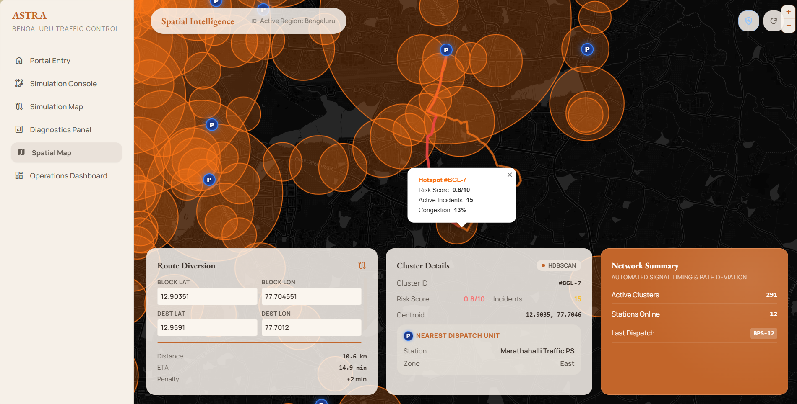
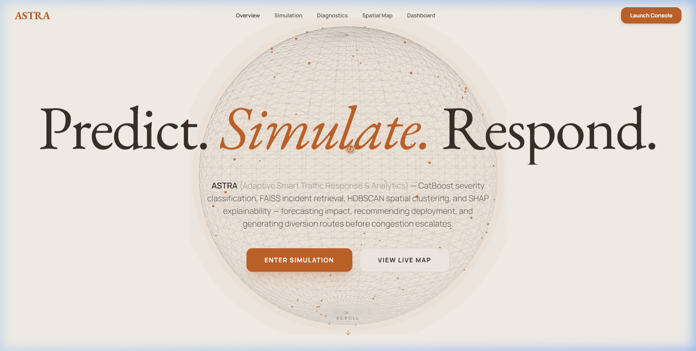
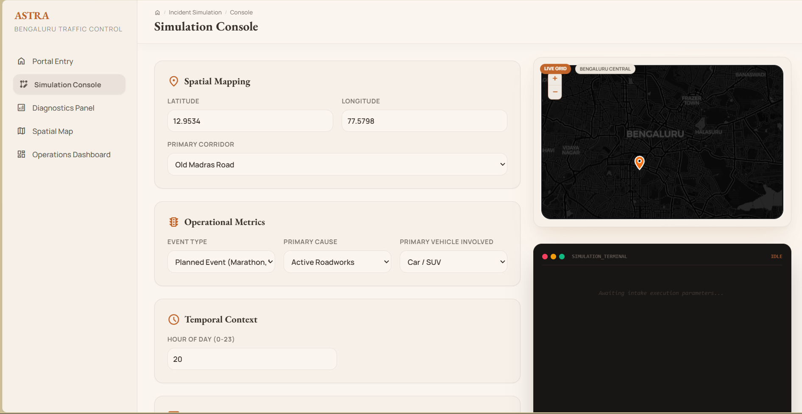
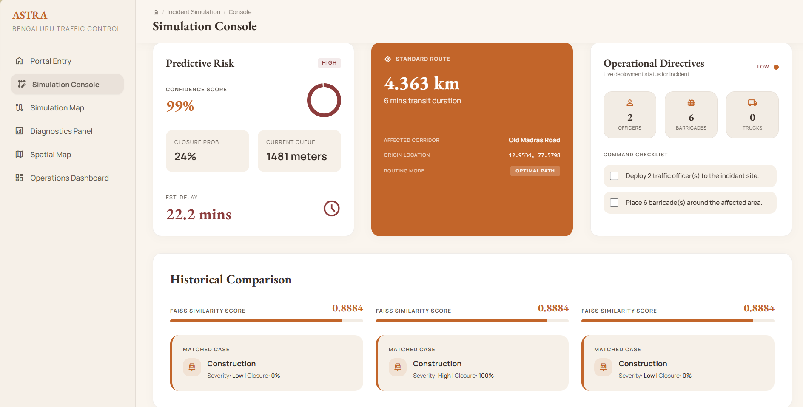
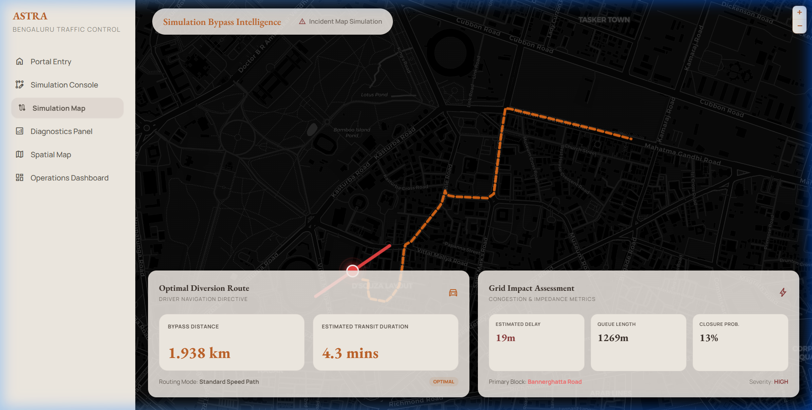
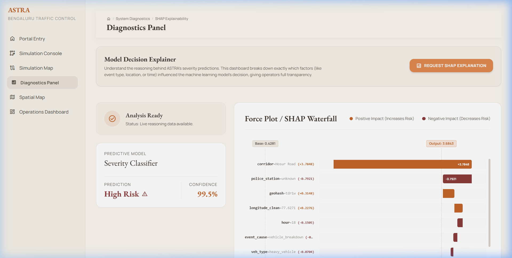

# ASTRA: Adaptive Smart Traffic Response & Analytics
> **Predict. Plan. Divert. Respond.**

ASTRA (Adaptive Smart Traffic Response & Analytics) — CatBoost severity classification, FAISS incident retrieval, HDBSCAN spatial clustering, and SHAP explainability — forecasting impact, recommending deployment, and generating diversion routes before congestion escalates.

---

##  Visual Showcase & Dashboard Gallery

### 1. Spatial Map
The **Spatial Map** displays live geographic traffic density clusters in Bengaluru using HDBSCAN spatial clustering. Operators can visualize traffic hot spots, inspect individual cluster telemetry, check dispatch station statuses, and calculate optimal route diversions directly on the interactive map.



### 2. Portal Entrance
A clean, premium portal entrance provides immediate status cards indicating current active events, resolution rate, and system performance metrics.


### 3. Simulation Console
The **Simulation Console** is the main dashboard interface where traffic coordinators log road incidents. By inputting details such as event type, primary cause, vehicles involved, and semantic incident descriptions, the console computes the immediate operational risk, queue build-ups, and generates dispatch directives (officers, barricades, and tow trucks).



### 4. Simulation Map & Active Routing
Once an incident is submitted, ASTRA runs NetworkX Dijkstra routing on the Bengaluru road network graph to calculate and display the optimal bypass route (orange dotted line) along with estimated delays and queue lengths.


### 5. Machine Learning & SHAP Diagnostics
ASTRA provides full explainability for its models using native C++ SHAP value calculations. High-risk features (such as geographical regions or specific corridors) are exposed in real-time.



---

##  Technical Architecture Overview

The system is split into three primary layers, integrated with high-efficiency caching and real-time streaming:

```
┌──────────────────────────────────────────────────────┐
│                  ASTRA SYSTEM                        │
│                                                      │
│  React Frontend (Vite, port 5174)                    │
│  ├── ControlPanel     (JWT auth, incident form)      │
│  ├── AnalyticsPanel   (predictions, SHAP, sim)      │
│  ├── MapContainer     (React-Leaflet, Bengaluru)     │
│  ├── LogConsole       (live event log)               │
│  └── Header           (ops dashboard, status cards) │
│                       │ HTTP + WebSocket              │
│  FastAPI Backend (Uvicorn, 4 workers, port 8000)     │
│  ├── JWT Auth          /api/v1/auth/token            │
│  ├── Predictions       /api/v1/predict/{severity,    │
│  │                                    closure}       │
│  ├── Similarity        /api/v1/similarity/search     │
│  ├── Routing           /api/v1/routing/diversion     │
│  ├── Explainability    /api/v1/explain               │
│  ├── Simulation        /ws/simulation                │
│  └── Health            /health/* /metrics            │
│       │                                              │
│  ThreadPoolExecutor (4 ML workers)                   │
│  ├── CatBoost Severity  (~1ms, cached)               │
│  ├── CatBoost Closure   (~1ms, cached)               │
│  ├── SentenceTransformer (~11ms, cached)             │
│  ├── FAISS Search        (~0.44ms, cached)           │
│  ├── Native SHAP C++     (~0.08ms, background)       │
│  └── NetworkX Dijkstra   (~12ms, cached)             │
│       │                                              │
│  In-Memory LRU Cache (6 tiers, 1000 items each)     │
│  Cache Keys: astra:{api_v}:{model_hash}:{build_id}:  │
│                           {cache_name}:{payload_hash}│
└──────────────────────────────────────────────────────┘
```

### 1. Frontend (React + Vite)
*   **Routing & Map**: Leaflet interactive maps representing Bengaluru's grid network.
*   **State Management**: Zustand global store with integrated WebSocket retry and reconnect logic.
*   **Operational Monitoring**: Automatically polls `/health/*` endpoints every 3 seconds.

### 2. Backend (FastAPI + Python 3.12)
*   **Concurrency**: Uvicorn running with 4 parallel worker processes.
*   **Threading**: Offloads CPU-bound ML inference paths to a `ThreadPoolExecutor` (4 workers) to prevent event loop starvation.
*   **Rate Limiting**: SlowAPI limits endpoint access to 60 requests/minute per client.
*   **Authentication**: HS256-signed JWT tokens for traffic operators, supervisors, and administrators.

### 3. ML Layer (CatBoost, FAISS, SentenceTransformer)
*   **Severity Classifier & Road Closure Predictor**: Powered by pre-compiled CatBoost `.cbm` models (~1ms inference).
*   **Semantic Similarity**: Encodes unstructured incident descriptions to 384-dimensional vectors via SentenceTransformer (`all-MiniLM-L6-v2`), projected to 64 dimensions via PCA.
*   **Similarity Search**: Conducts L2 L2-flat similarity search using a FAISS index (~0.44ms).
*   **Explainability**: Utilizes CatBoost C++ native SHAP calculations offloaded to FastAPI `BackgroundTasks`.

### 4. Resilient Caching System
*   **6-Tier Cache**: Process-isolated in-memory LRU cache (1,000-item cap) with automated fallback.
*   **Cache Keys**: Versioned keys prevent namespace collisions across deployment builds:
    `astra:{api_version}:{model_hash}:{build_id}:{cache_name}:{payload_hash}`

---

##  Performance & Correctness Metrics

ASTRA was subjected to load testing under 50 concurrent users generating 250 requests:

| Metric | Baseline | After Refactor (Optimized) |
| :--- | :---: | :---: |
| **P50 Latency** | 2,107.97 ms | **46.45 ms** |
| **P95 Latency** | 2,765.24 ms | **73.97 ms** |
| **P99 Latency** | 2,890.11 ms | **84.55 ms** |
| **Avg Latency** | ~2,100 ms | **45.93 ms** |
| **Success Rate** | 24.0% | **100.0%** |

### Correctness Audit
*   **Prediction Equivalence**: 100.00% identical outputs compared to un-optimized code.
*   **SHAP Equivalence**: 100.00% matching values between Python `TreeExplainer` and C++ native compiler.
*   **Fuzzy Collision Rate**: 0.00%.

---

## 🛠️ Quick Start Guide

### Prerequisites
Make sure Python 3.12 and Node.js are installed on your system.

### Option A: Automated Batch Script (Recommended for Windows)
Double-click or execute the helper batch script in the root directory:
```cmd
run_project.bat
```
This script automatically:
1. Runs the ML pipeline to verify/export binary models.
2. Starts the FastAPI backend on `http://127.0.0.1:8000`.
3. Starts the Vite frontend server on `http://localhost:5174`.

### Option B: Manual Startup

1.  **Initialize Virtual Environment**:
    ```bash
    python -m venv .venv
    .\.venv\Scripts\activate
    pip install -r src/backend/requirements.txt
    ```

2.  **Verify/Prepare ML Models**:
    ```bash
    python -m src.ml.train_production_pipeline
    ```

3.  **Start Backend**:
    ```bash
    cd src/backend
    python -m uvicorn app.main:app --host 127.0.0.1 --port 8000
    ```

4.  **Start Frontend**:
    ```bash
    cd ../frontend2
    npm install
    npm run dev -- --port 5174
    ```

5.  **Access the Dashboard**:
    Open [http://localhost:5174](http://localhost:5174) in your browser.
